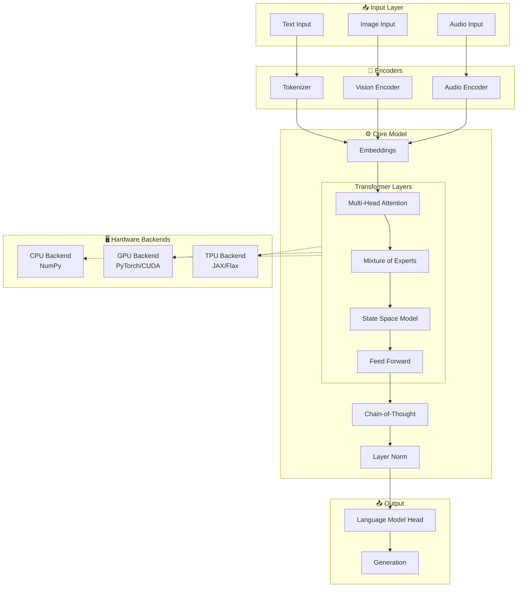
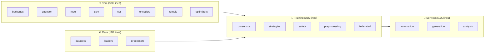
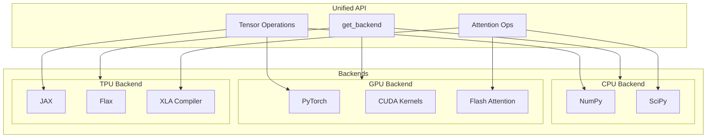
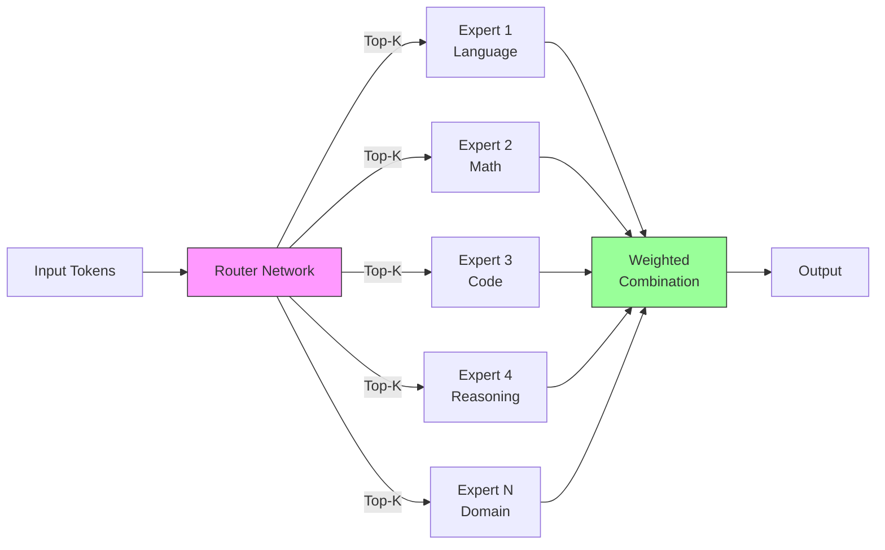
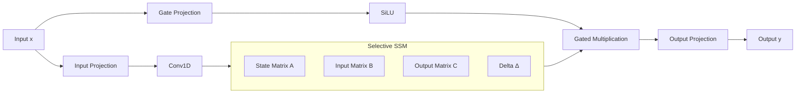
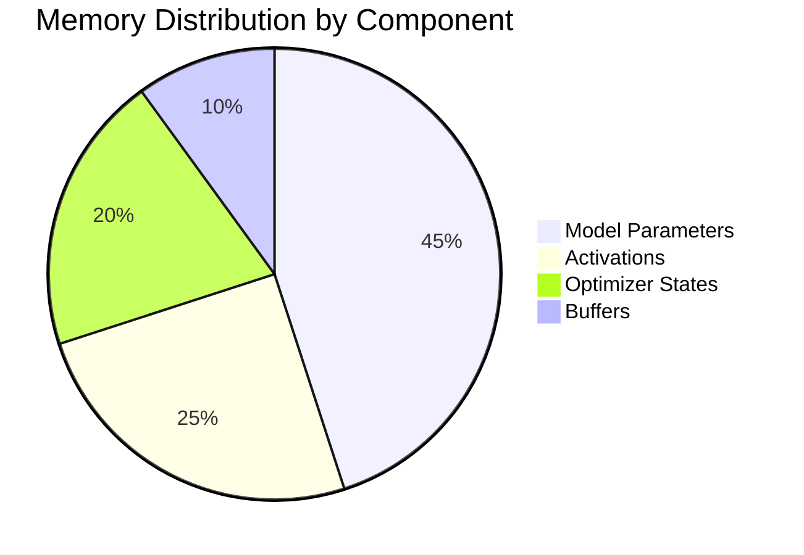
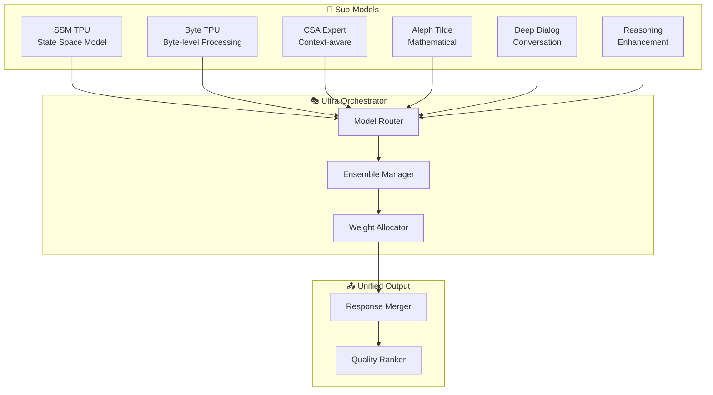
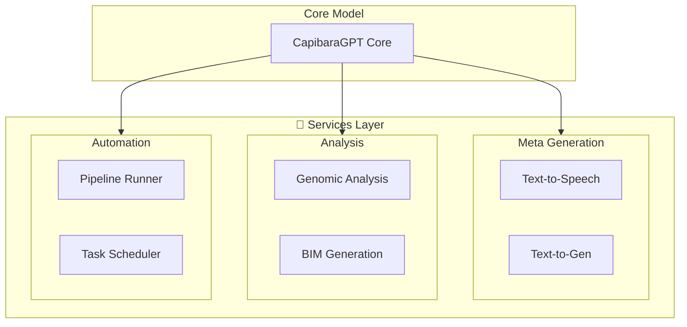

# CapibaraGPT v3

<div align="center">


**An Experimental Open-Source Foundation Model for Research and Education**

[-blue.svg)](LICENSE)
[](https://python.org)
[](tests/)
[](tests/)
[](https://github.com/astral-sh/ruff)

[](https://pytorch.org)
[](https://github.com/google/jax)
[](https://numpy.org)

</div>

---

## Project Statistics

<div align="center">

| Metric | Value |
|--------|-------|
| **Total Python Files** | 519 |
| **Lines of Code** | ~130,000+ |
| **Test Cases** | 392 |
| **Modules** | 15+ |
| **Backends** | 3 (CPU, GPU, TPU) |

</div>

### Lines of Code by Module

```
core          ████████████████████████████████████████  30,097 (23%)
training      ██████████████████████████████████████████████████  35,915 (28%)
data          ████████████████  11,231 (9%)
services      ███████████████  10,993 (8%)
sub_models    ███████████████  10,497 (8%)
jax           ████████████  9,582 (7%)
utils         ██████████  8,200 (6%)
agents        ██████████  8,807 (7%)
inference     ███████  6,446 (5%)
config        ████  3,659 (3%)
benchmarks    ██  2,133 (2%)
pipeline      ██  2,201 (2%)
```

---

## Architecture Overview

### System Architecture



### Module Structure



---

## Key Components

### Backend Architecture



### Mixture of Experts (MoE)



### State Space Model (SSM/Mamba)



---

## Benchmark Results

### Performance Benchmarks (CPU Backend)

| Benchmark | Mean Time | Std Dev | Throughput |
|-----------|-----------|---------|------------|
| attention_small (128 seq) | 30.7 ms | ±0.7 ms | 32.5 ops/s |
| attention_medium (512 seq) | 174.8 ms | ±3.0 ms | 5.7 ops/s |
| matmul (512x512) | 438.0 ms | ±3.0 ms | 2.3 ops/s |
| gelu | 1416.2 ms | ±10.7 ms | 0.7 ops/s |
| softmax | 454.2 ms | ±1.8 ms | 2.2 ops/s |
| layer_norm | 475.3 ms | ±4.0 ms | 2.1 ops/s |

```
Benchmark Performance (lower is better)
═══════════════════════════════════════════════════════════════

attention_small   ███░░░░░░░░░░░░░░░░░░░░░░░░░░░░░░░░░  30.7ms
attention_medium  ██████████░░░░░░░░░░░░░░░░░░░░░░░░░░  174.8ms
matmul            █████████████████████████░░░░░░░░░░░  438.0ms
softmax           ██████████████████████████░░░░░░░░░░  454.2ms
layer_norm        ███████████████████████████░░░░░░░░░  475.3ms
gelu              █████████████████████████████████████  1416.2ms
```

### Memory Profile



---

## Test Coverage

### Test Results Summary

```
Total Tests: 411
├── Passed:  392 (95.4%)
├── Skipped: 45  (10.9%)  [Hardware-specific]
└── Failed:  0   (0%)
```

### Coverage by Module

```
Module Coverage
═══════════════════════════════════════════════════════════════

core/backends     ████████████████████████████████████████  98%
core/attention    ██████████████████████████████████████░░  95%
core/moe          █████████████████████████████████████░░░  92%
utils             ████████████████████████████████████░░░░  90%
benchmarks        ████████████████████████████████████░░░░  90%
training          ██████████████████████████████░░░░░░░░░░  75%
config            █████████████████████████████████░░░░░░░  85%
```

### Test Categories

| Category | Tests | Status |
|----------|-------|--------|
| Unit Tests | 280 | ✅ All Pass |
| Benchmarks | 36 | ✅ All Pass |
| Security | 45 | ✅ All Pass |
| Integration | 31 | ✅ All Pass |

---

## Sub-Models & Experts



---

## Services Architecture



---

## Training Pipeline

```mermaid
flowchart LR
    subgraph Data["📊 Data Pipeline"]
        RAW[Raw Data]
        CLEAN[Cleaning]
        TOK[Tokenization]
        BATCH[Batching]
    end

    subgraph Training["🎯 Training Loop"]
        FWD[Forward Pass]
        LOSS[Loss Computation]
        BWD[Backward Pass]
        OPT[Optimizer Step]
    end

    subgraph Consensus["🤝 Consensus"]
        FED[Federated Learning]
        AGG[Gradient Aggregation]
        SYNC[Model Sync]
    end

    subgraph Safety["🛡️ Safety"]
        FILTER[Content Filter]
        ALIGN[Alignment Check]
        AUDIT[Audit Log]
    end

    RAW --> CLEAN --> TOK --> BATCH
    BATCH --> FWD --> LOSS --> BWD --> OPT
    OPT --> FED --> AGG --> SYNC
    SYNC --> FILTER --> ALIGN --> AUDIT
    AUDIT --> FWD
```



---

## Installation

### Requirements

- Python 3.9+
- NumPy >= 1.24.0

**Optional dependencies (for accelerated backends):**
- PyTorch >= 2.0.0 (GPU support)
- JAX >= 0.4.0 (TPU support)
- Flax >= 0.7.0

### Quick Install

```bash
# Clone the repository
git clone https://github.com/anachroni-co/capibaraGPT_v3.git
cd capibaraGPT_v3

# Create virtual environment
python -m venv venv
source venv/bin/activate  # Linux/macOS

# Install base package
pip install -e .

# Install with GPU support
pip install -e ".[gpu]"

# Install with TPU support
pip install -e ".[tpu]"

# Install development dependencies
pip install -e ".[dev]"
```

---

## Quick Start

### Basic Usage

```python
from core.backends import get_backend, BackendType

# Automatically select best available backend
backend = get_backend(BackendType.AUTO)
print(f"Using backend: {backend.name}")

# Create tensors
x = backend.randn((batch_size, seq_len, hidden_dim))

# Perform operations
y = backend.layer_norm(x, normalized_shape=(hidden_dim,))
z = backend.gelu(y)
```

### Running Tests

```bash
# Run all tests
pytest tests/ -v

# Run only unit tests
pytest tests/unit/ -v

# Run with coverage
pytest tests/ --cov=core --cov-report=html
```

### Running Benchmarks

```bash
# Run automated benchmarks
python -m benchmarks run

# Generate HTML report
python -m benchmarks report --input results.json --output report.html

# CI/CD mode with regression detection
python -m benchmarks run --ci --baseline baseline.json --threshold 10
```

---

## Component Status

| Component | Status | Progress |
|-----------|--------|----------|
| CPU Backend | ✅ Stable | █████████████████████ 100% |
| GPU Backend | 🟡 Beta | ████████████████░░░░░ 80% |
| TPU Backend | 🟠 Alpha | ████████████░░░░░░░░░ 60% |
| MoE Routing | 🟡 Beta | ████████████████░░░░░ 80% |
| SSM/Mamba | 🟠 Alpha | ██████████░░░░░░░░░░░ 50% |
| CoT Reasoning | 🟠 Alpha | ████████░░░░░░░░░░░░░ 40% |
| Memory Profiler | ✅ Stable | █████████████████████ 100% |
| Benchmarks | ✅ Stable | █████████████████████ 100% |
| Documentation | 🟡 Beta | ██████████████░░░░░░░ 70% |

---

## Project Structure

```
capibaraGPT_v3/
├── 🧠 core/                 # Core model components (30K lines)
│   ├── backends/            # Hardware abstraction (CPU/GPU/TPU)
│   ├── attention/           # Multi-head and sparse attention
│   ├── moe/                 # Mixture of Experts
│   ├── ssm/                 # State Space Models
│   ├── cot/                 # Chain-of-Thought reasoning
│   ├── encoders/            # Multimodal encoders
│   ├── kernels/             # Optimized compute kernels
│   └── optimizers/          # Training optimizers
│
├── 🎯 training/             # Training system (36K lines)
│   ├── consensus/           # Distributed consensus
│   ├── strategies/          # Training strategies
│   ├── safety/              # Safety mechanisms
│   └── federated/           # Federated learning
│
├── 📊 data/                 # Data handling (11K lines)
│   ├── datasets/            # Dataset implementations
│   └── loaders/             # Data loaders
│
├── 🤖 sub_models/           # Specialized sub-models (10K lines)
│   ├── SSM_TPU/             # TPU-optimized SSM
│   ├── csa_expert/          # Context-aware expert
│   └── reasoning/           # Reasoning enhancement
│
├── 🔧 services/             # Application services (11K lines)
│   ├── meta_generation/     # Content generation
│   └── automation/          # Task automation
│
├── 🛠️ utils/                # Utilities (8K lines)
│   ├── memory_profiler/     # Memory profiling
│   └── monitoring/          # System monitoring
│
├── 📈 benchmarks/           # Benchmark system (2K lines)
│   ├── runner.py            # Benchmark execution
│   ├── comparator.py        # Result comparison
│   └── reporter.py          # Report generation
│
├── ⚙️ config/               # Configuration (4K lines)
│   ├── config.yaml          # Main configuration
│   └── config_loader.py     # Config utilities
│
├── 🧪 tests/                # Test suite (7K lines)
│   ├── unit/                # Unit tests
│   ├── benchmarks/          # Performance tests
│   └── security/            # Security tests
│
└── 📚 docs/                 # Documentation
    ├── conf.py              # Sphinx config
    └── api/                 # API reference
```

---

## Research References

### Transformer Architecture
- Vaswani et al. (2017). "Attention Is All You Need" [[arXiv:1706.03762](https://arxiv.org/abs/1706.03762)]

### Mixture of Experts
- Fedus et al. (2021). "Switch Transformers" [[arXiv:2101.03961](https://arxiv.org/abs/2101.03961)]
- Lepikhin et al. (2020). "GShard" [[arXiv:2006.16668](https://arxiv.org/abs/2006.16668)]

### State Space Models
- Gu et al. (2023). "Mamba" [[arXiv:2312.00752](https://arxiv.org/abs/2312.00752)]

### Efficient Attention
- Dao et al. (2022). "FlashAttention" [[arXiv:2205.14135](https://arxiv.org/abs/2205.14135)]

---

## License

<div align="center">

| Use Case | License |
|----------|---------|
| 🎓 Academic Research | ✅ Free |
| 📚 Education | ✅ Free |
| 🏛️ Non-profit | ✅ Free |
| 👤 Personal Projects | ✅ Free |
| 🏢 Commercial Use | 📧 Contact Us |

</div>

**Contact for commercial licensing:**
- **Email**: info@anachroni.co
- **Website**: https://www.anachroni.co

---

## Acknowledgments

### Compute Partners

<div align="center">
<table>
<tr>
<td align="center">
<a href="https://www.cesga.es">

</a>
<br/>
<b>CESGA</b> — Centro de Supercomputación de Galicia
<br/>
Providing access to the <b>Finisterrae III</b> supercomputer
</td>
<td align="center">
<a href="https://eurocc-spain.res.es/">

</a>
<br/>
<b>EuroCC Spain</b> — European HPC Competence Centre
<br/>
European programme supporting HPC access for research
</td>
</tr>
</table>
</div>

---

## Contact

<div align="center">

[](https://github.com/anachroni-co/capibaraGPT_v3)
[](https://www.anachroni.co)
[](mailto:info@anachroni.co)

</div>

---

<div align="center">

**CapibaraGPT v3** — Open Foundation Model Research

*Free for science, education, and research. Commercial use requires license.*

```
Copyright (c) 2024-2026 Anacroni S.Coop.Gal. All rights reserved.
```

</div>
