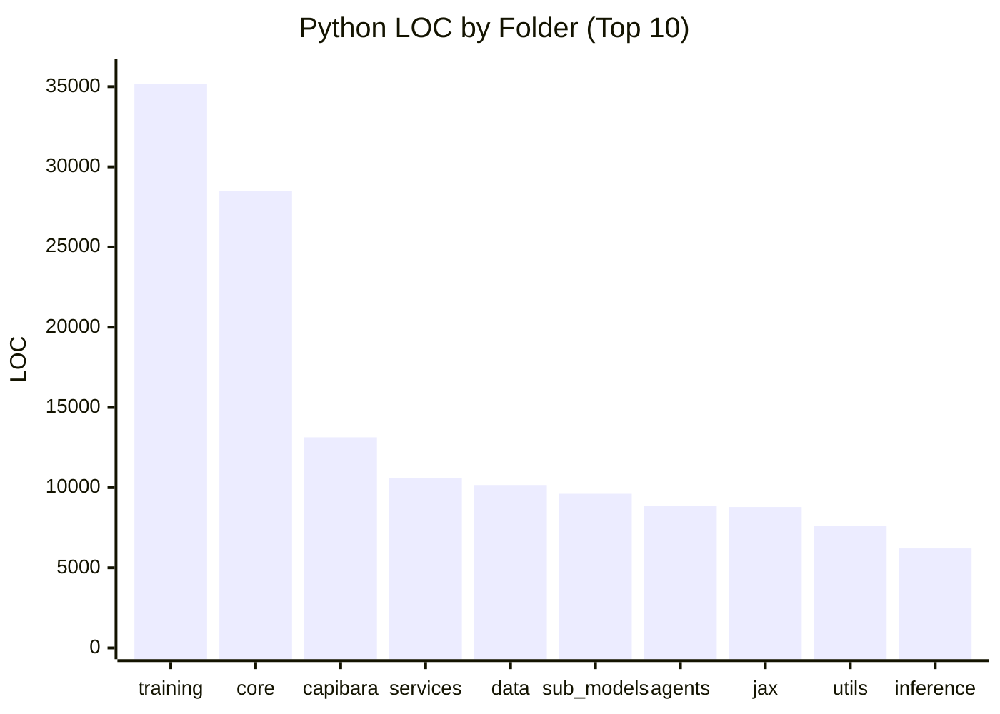
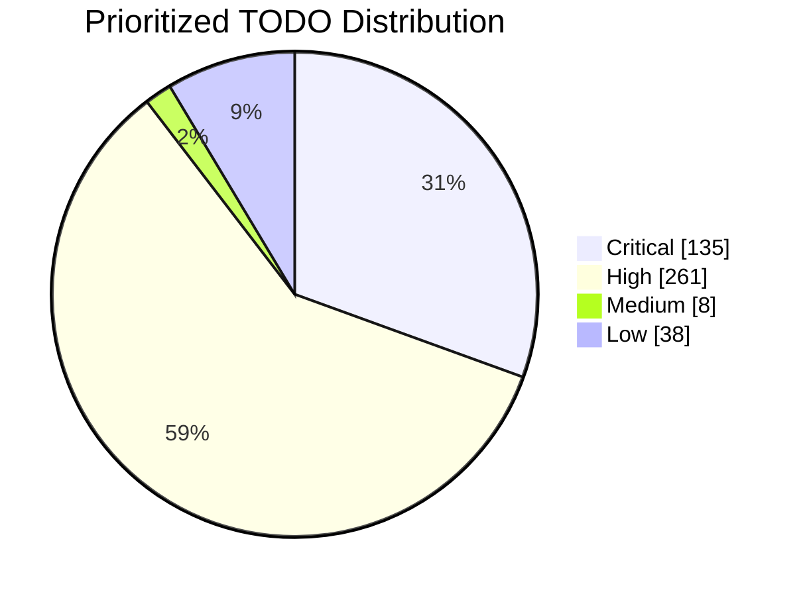

# CapibaraGPT v3

Experimental open-source foundation model stack for research and education.

## What this repository includes

- Multi-backend core runtime (CPU, optional GPU/TPU).
- Training modules (consensus, strategies, federated paths).
- Inference modules (including quantization/hybrid experiments).
- Data pipelines and dataset tooling.
- Optional services and integrations.
- Test and benchmark suites.

## Live Repository Metrics

Last refreshed: `2026-02-07`

### Snapshot

| Metric | Value |
|---|---:|
| Python files (repo only) | 551 |
| Markdown files (repo only) | 90 |
| Python LOC (repo only) | 164,723 |
| Test files (`tests/test_*.py`) | 29 |
| Collected `test_` functions (static scan) | 22 |
| Pending TODO items (global) | 225 |
| Pending TODO items (prioritized) | 442 |

### Python LOC by top-level folder

| Folder | LOC |
|---|---:|
| `training` | 35,177 |
| `core` | 28,474 |
| `capibara` | 13,137 |
| `services` | 10,601 |
| `data` | 10,162 |
| `sub_models` | 9,616 |
| `agents` | 8,873 |
| `jax` | 8,788 |
| `utils` | 7,607 |
| `inference` | 6,208 |



### Pending TODO distribution by priority

| Priority | Pending |
|---|---:|
| Critical | 135 |
| High | 261 |
| Medium | 8 |
| Low | 38 |



## Current reality

This is an active research codebase, not a production-hardened product.
Some modules are fully functional, while others are still under active implementation.

Use these files as the source of truth for pending work:

- `TODOs.md`
- `TODOs_PRIORITIZED.md`
- `GITHUB_ISSUES.md`

## Requirements

- Python `>=3.9`
- `pip`

Optional acceleration backends:

- GPU: PyTorch + CUDA
- TPU: JAX + Flax

## Installation

```bash
git clone https://github.com/anachroni-co/capibaraGPT_v3.git
cd capibaraGPT_v3

python -m venv .venv
# Linux/macOS
source .venv/bin/activate
# Windows PowerShell
# .\.venv\Scripts\Activate.ps1

pip install -e .
```

Optional extras:

```bash
pip install -e ".[dev]"
pip install -e ".[gpu]"
pip install -e ".[tpu]"
```

## Quick start

```python
from core.backends import get_backend, BackendType

backend = get_backend(BackendType.AUTO)
print(f"Using backend: {backend.name}")
```

## Run tests

```bash
pytest tests/ -v
```

Coverage:

```bash
pytest tests/ --cov=core --cov-report=term-missing
```

## Run benchmarks

```bash
python -m benchmarks run
```

## Repository layout

- `core/`: model/runtime components.
- `training/`: training systems and strategies.
- `inference/`: inference engines and quantization paths.
- `data/`: datasets, processing, and loading.
- `services/`: optional service-level integrations.
- `sub_models/`: specialized expert modules.
- `tests/`: unit/integration/security/benchmark tests.
- `docs/`: project documentation.

## Limitations

- Several advanced paths still include placeholder/mock logic.
- Hardware-specific features depend on external stacks and environment.
- Performance numbers can vary significantly across machines.

## Reproduce metrics

```bash
# Python/Markdown files
rg --files -g "*.py" -g "!**/.venv/**" -g "!**/.git/**" | wc -l
rg --files -g "*.md" -g "!**/.venv/**" -g "!**/.git/**" | wc -l

# Pending TODO lines
rg -n "^- \[ \]" TODOs.md | wc -l
rg -n "^- \[ \]" TODOs_PRIORITIZED.md | wc -l
```

## License

Dual licensing (open + commercial). See `LICENSE`.

## Contact

- GitHub: `https://github.com/anachroni-co/capibaraGPT_v3`
- Website: `https://www.anachroni.co`
- Email: `info@anachroni.co`