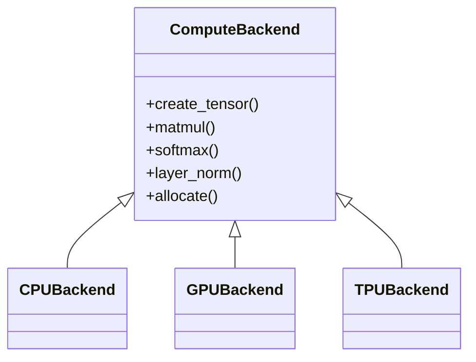

# Backends

CapibaraGPT v3 supports three compute backends through a unified interface.

## Backend hierarchy



## CPU Backend

Default fallback that uses NumPy. Always available.

## GPU Backend (`core/backends/gpu_backend.py`)

PyTorch/CUDA backend optimized for NVIDIA A-100:

- Flash Attention 2
- Tensor Cores with mixed precision (BF16/FP16)
- DeepSpeed ZeRO integration

Uses **lazy imports** via `core/backends/lazy_import.py`:

```python
from core.backends.lazy_import import ensure_torch

def _ensure_torch():
    global torch, nn, F
    if torch is None:
        torch, nn, F = ensure_torch()
```

## TPU Backend (`core/backends/tpu_backend.py`)

JAX/Flax backend for TPU v4-32 and v6e-64 pods:

- XLA compilation
- SPMD sharding
- Optax optimizers

Uses the same lazy-import utility:

```python
from core.backends.lazy_import import ensure_jax

def _ensure_jax():
    global jax, jnp, flax, optax
    if jax is None:
        jax, jnp, flax, optax = ensure_jax()
```

## Backend selection

The system auto-selects the best available backend at runtime. You can also
force a backend via configuration:

```python
from core.backends import create_backend

backend = create_backend("gpu")  # or "tpu", "cpu"
```
