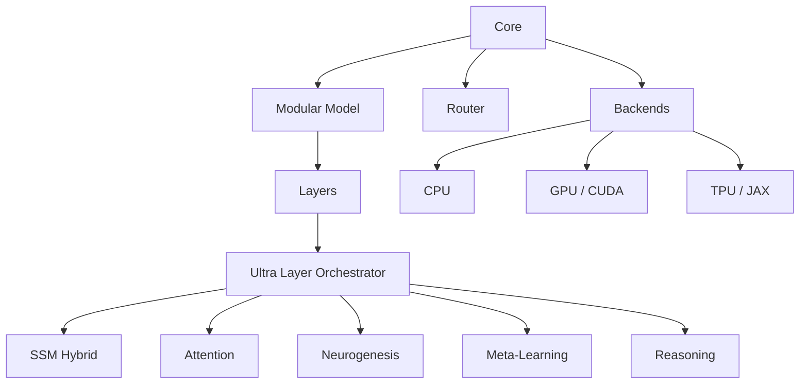

# Architecture Overview

CapibaraGPT v3 is organized into four major subsystems that work together
through well-defined interfaces.

## Core (`core/`)

The core subsystem provides:

- **`ComputeBackend`** — Abstract interface implemented by CPU, GPU, and TPU backends
- **`ModuleGate`** — Runtime capability checker that enables/disables modules based on available hardware
- **`CoreIntegratedTokenRouter`** — Routes tokens to expert sub-networks
- **`ModularModel`** — Top-level model that assembles layers using the gate map

## Layers (`layers/`)

All neural network layers live here, grouped by function:

| Group | Layers | Purpose |
|-------|--------|---------|
| `sparsity/` | BitNet, MoR, SparseCapibara, AffineQuantizer | Efficient sparse computation |
| `abstract_reasoning/` | Platonic, GameTheory, Quineana | Higher-order reasoning |
| `pasive/` | DistributedAttention, SyntheticEmbedding | Core attention and embeddings |
| `ssm_hybrid_layers` | Mamba/S4 hybrid, fused TPU kernels | State-space models |
| `meta_la` | MetaLA (MAML-style) | Few-shot adaptation |
| `neurogenesis` | TpuOptimizedNeurogenesis | Dynamic neuron creation |

The **Ultra Layer Orchestrator** composes these into a full stack, applying
wrappers (neurogenesis, reasoning, meta-LA, distributed attention) via the
`CompositeWrapper` pattern.

## Training (`training/`)

Distributed training pipelines, consensus algorithms, and TPU-optimized
trainers.

## Inference (`inference/`)

Quantization engines (INT8, advanced quantizers), KV-cache optimization, and
ARM-optimized inference paths.
